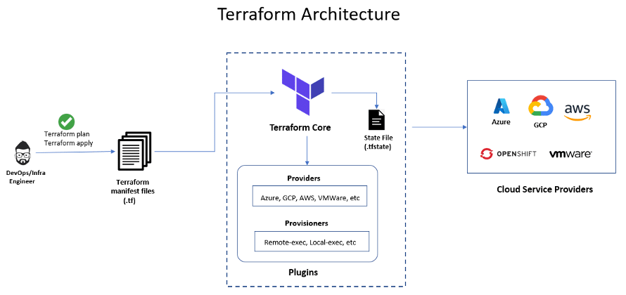

# **Chapter 1** - Overview & Getting Started with Terraform 

## 1.1 Purpose of the Lab
In this lab, you will learn how to use Terraform as the Infrastructure-as-Code (IaC) backbone for the Arculus edge-security testbed. You’ll learn how to describe cloud resources declaratively (VPCs, subnets, security groups, EC2 instances, IAM, SSM, KMS, and Secrets Manager), apply guardrails (least-privilege IAM, permission boundaries, encrypted storage, SSM-only access), and package repeatable environments as modules for students and instructors.

## 1.2 Prerequisites
To follow along and get the most out of this lab, you should have:

**Accounts & Access**

* An AWS account with programmatic access (IAM user/role) and an administrative sandbox or teaching account.

* MFA enabled for the console; an access key/secret (or AWS SSO) for CLI use.

* Local Tooling

* Terraform (v1.6+ recommended).

* AWS CLI (v2+), configured via aws configure or SSO.

* A code editor (VS Code recommended) with HCL extensions.

**Knowledge & Concepts (lightweight)**

* Basic AWS networking (VPC, subnets, routing).

* IAM fundamentals (roles, policies, permission boundaries).

* Why IaC matters: versioning, reviewability, repeatability, and drift detection.

**What we provide in this chapter:**

* Starter Terraform workspace & folder layout.

* A minimal yet secure AWS baseline (VPC, subnets, SSM-managed EC2, KMS CMK, logging).

## 1.3 References to guide lab work
Please use the links below to learn the related information for this lab. 

* <a href = "https://developer.hashicorp.com/terraform/tutorials">*Terraform by HashiCorp*</a> - Introductions & Tutorials
* <a href = "https://registry.terraform.io/providers/hashicorp/aws/latest">*Terraform AWS Provider*</a> - Registry
* <a href="https://docs.aws.amazon.com/cli/latest/userguide/cli-chap-welcome.html">*AWS CLI*</a> - v2
* <a href ="https://docs.aws.amazon.com/systems-manager/latest/userguide/session-manager.html">*AWS Systems Manager SSM*</a> - Session Manager
* <a href = "https://docs.aws.amazon.com/kms/latest/developerguide/overview.html">*AWS KMS*</a> - Key Management Service
* <a href = "https://aws.amazon.com/">*AWS (Amazon Web Services)*</a> - A cloud platform that offers a variety of services, including storage, compute, and databases. AWS allows users to build and run applications on-demand.

## 1.4 Conceptual Overview:

## 1.5 Goals/Outcomes:
By the end of this lab module, you will be able to:

(i)	Understand the Terraform Worflow & State

* Explain the plan/apply/destroy lifecycle and why state is critical.
* Differentiate local vs remote state and when to use S3 + DynamoDB locking.

(ii) Create a Minimal, Secure AWS Baseline with IaC

* Provision a VPC with public/private subnets, NAT, and route tables.
* Set up security groups with tight ingress/egress and tags for policy-as-code.
* Launch EC2 instances that are SSM-managed (no public SSH), with hardened user_data bootstrapping.

(iii) Apply Guardrails & Least Privilege IAM

* Author IAM roles/policies for EC2/SSM that follow least-privilege.
* Understand and attach permission boundaries for student roles in a teaching environment.
* Restrict administration to SSM Session Manager (no public keys, no open SSH).

(iv) Modularize Infrastructure

* Convert repeatable resources into Terraform modules (e.g., network, compute, logging).
* Parameterize modules with sensible defaults and input validation.

(v) Prepare for Arculus Testbed Integration

* Expose outputs (private IPs, instance profiles, SSM target tags) that later chapters use to deploy Arculus services.
* Align tagging strategy (e.g., Project=Arculus, Env=Lab, Owner=StudentID) for cost visibility and policy targeting.
