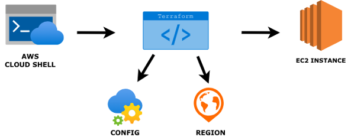

# **Chapter 2** - Provisioning EC2 using CloudShell & Terraform

## 2.1 Overview

In this chapter, you’ll use AWS CloudShell (browser-based shell with AWS CLI) to run Terraform. We’ll keep the setup lightweight by installing Terraform to /tmp for this session and storing Terraform state and plugin cache in /tmp to avoid home-directory limits. 

You’ll write a minimal Terraform config that creates a VPC, public subnet, internet route, a unique egress-only security group, and an Ubuntu 22.04 t2.medium EC2 instance—then apply, verify outputs, and destroy when finished.

<p align="center"> </p>

## 2.2 Navigating to CloudShell

* Sign into your <a href = "https://console.aws.amazon.com/">*AWS Management Console*</a>
* Make sure to select the US East (N. Virginia) region in the top-right part of your screen.

<p align="center"> </p>


* In the top search bar, type "CloudShell" and select **CloudShell** from the services list.

<p align="center"> </p>
* You will arrive in this CloudShell terminal:

<p align="center"> </p>

## 2.2 Setting up Terraform


* Install Terraform into /tmp for this session, reset env vars so it uses CloudShell’s role credentials (no profiles), and point Terraform’s state and plugin cache to /tmp to avoid home-directory quotas—then move into the working directory.

```bash
export AWS_REGION=${AWS_REGION:-us-east-1}
```
```bash
unset AWS_PROFILE AWS_SDK_LOAD_CONFIG AWS_ACCESS_KEY_ID AWS_SECRET_ACCESS_KEY AWS_SESSION_TOKEN

TF_VERSION="1.9.5"
ARCH=$(uname -m); case "$ARCH" in x86_64) TF_ARCH="amd64" ;; aarch64) TF_ARCH="arm64" ;; *) echo "Unsupported arch: $ARCH"; exit 1 ;; esac
mkdir -p /tmp/bin /tmp/arculus/ch2
curl -fsSLo /tmp/terraform.zip "https://releases.hashicorp.com/terraform/${TF_VERSION}/terraform_${TF_VERSION}_linux_${TF_ARCH}.zip"
unzip -o /tmp/terraform.zip -d /tmp/bin >/dev/null
export PATH="/tmp/bin:$PATH"
```
```bash
terraform -version
```

```bash
export TF_DATA_DIR=/tmp/.tfdata
export TF_PLUGIN_CACHE_DIR=/tmp/.tfplugins
```
```bash
mkdir -p "$TF_PLUGIN_CACHE_DIR"

# Work directory
cd /tmp/arculus/ch2
```

## 2.3 Running Main.tf Scripts

```bash
terraform init -reconfigure
terraform fmt
terraform validate
terraform apply -auto-approve -var="region=${AWS_REGION}" -var="az=us-east-1a"
```
<p align="center"> </p>

* Terraform finished initialization successfully—your working directory is set up and the AWS provider/plugins were found.

<p align="center"> </p>

## 2.4 Verify you results:
```bash
terraform output
aws ec2 describe-instances \
  --filters "Name=tag:Project,Values=arculus-ch2" "Name=instance-state-name,Values=pending,running" \
  --query 'Reservations[].Instances[].[InstanceId,InstanceType,Placement.AvailabilityZone,State.Name,PublicIpAddress,Tags[?Key==`Name`].Value|[0],ImageId]' \
  --output table
```
<p align="center"> </p>

* Copy the **Instance ID value**. For example, in the picture above, the instance ID value is "i-0471f2120ae5e11e9".

* In the top search bar, type EC2 and select **EC2** from the services list.

<p align="center"> </p>

<p align="center"> </p>

<p align="center"> </p>

## 2.5 Clean Up
```bash
terraform destroy -auto-approve -var="region=${AWS_REGION}" -var="az=$(terraform output -raw az_used 2>/dev/null || echo us-east-1a)"
```

## 2.6 As a Result

This chapter demonstrated provisioning of an EC2 stack with Terraform from AWS CloudShell—installing Terraform in /tmp, directing Terraform state and plugin cache to /tmp, and relying on CloudShell’s role-based credentials. A minimal, production-style configuration was authored: VPC, public subnet, internet route, a unique egress-only security group, and an Ubuntu 22.04 t2.medium instance. Deployment was initialized, applied, and verified via Terraform outputs and the EC2 console.
