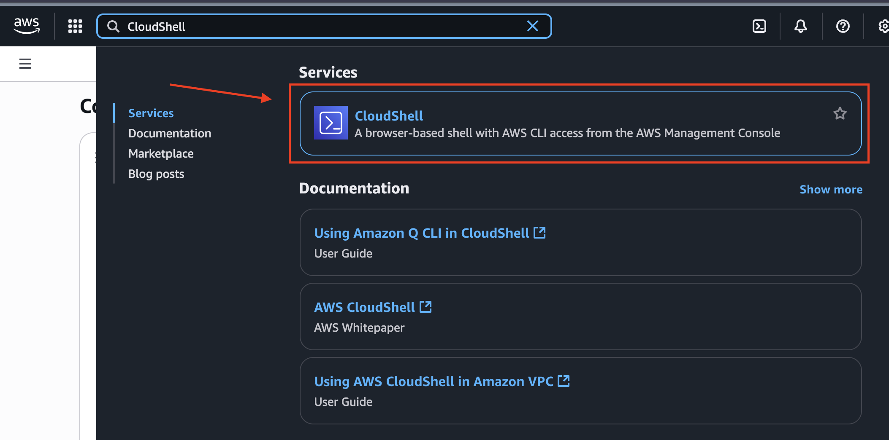
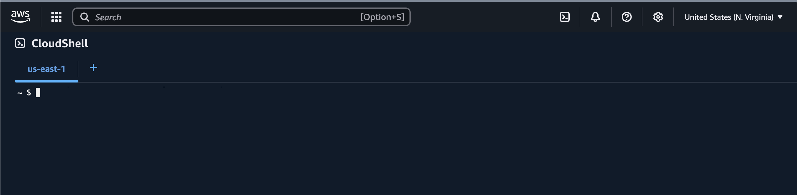
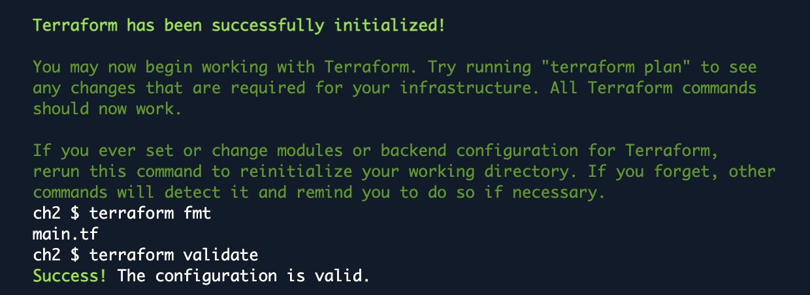
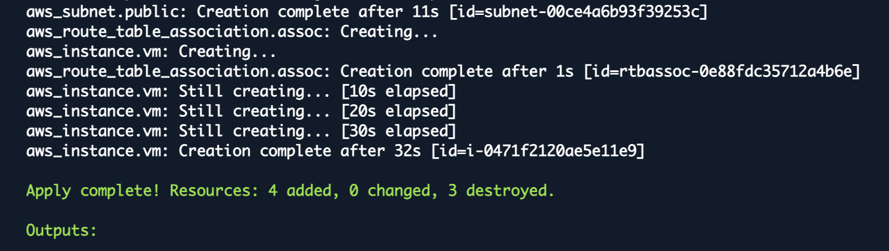

# **Chapter 2** - Provisioning EC2 using CloudShell & Terraform

## 2.1 Overview

In this chapter, you’ll use AWS CloudShell (browser-based shell with AWS CLI) to run Terraform. We’ll keep the setup lightweight by installing Terraform to /tmp for this session and storing Terraform state and plugin cache in /tmp to avoid home-directory limits. 

You’ll write a minimal Terraform config that creates a VPC, public subnet, internet route, a unique egress-only security group, and an Ubuntu 22.04 t2.medium EC2 instance—then apply, verify outputs, and destroy when finished.

## 2.2 Navigating to CloudShell

* Sign into your <a href = "https://console.aws.amazon.com/">*AWS Management Console*</a>
* Make sure to select the US East (N. Virginia) region in the top-right part of your screen.

<a name = "fig2.1"></a></center>


In the top search bar, type "CloudShell" and select **CloudShell** from the services list.

<a name = "fig2.1"></a></center>

You will arrive in this CloudShell terminal:

<a name = "fig2.1"></a></center>

## 2.2 Running Main.tf Script to Launch EC2 Instance


* Install Terraform into /tmp for this session, reset env vars so it uses CloudShell’s role credentials (no profiles), and point Terraform’s state and plugin cache to /tmp to avoid home-directory quotas—then move into the working directory.

```bash
export AWS_REGION=${AWS_REGION:-us-east-1}

unset AWS_PROFILE AWS_SDK_LOAD_CONFIG AWS_ACCESS_KEY_ID AWS_SECRET_ACCESS_KEY AWS_SESSION_TOKEN

TF_VERSION="1.9.5"
ARCH=$(uname -m); case "$ARCH" in x86_64) TF_ARCH="amd64" ;; aarch64) TF_ARCH="arm64" ;; *) echo "Unsupported arch: $ARCH"; exit 1 ;; esac
mkdir -p /tmp/bin /tmp/arculus/ch2
curl -fsSLo /tmp/terraform.zip "https://releases.hashicorp.com/terraform/${TF_VERSION}/terraform_${TF_VERSION}_linux_${TF_ARCH}.zip"
unzip -o /tmp/terraform.zip -d /tmp/bin >/dev/null
export PATH="/tmp/bin:$PATH"
terraform -version

export TF_DATA_DIR=/tmp/.tfdata
export TF_PLUGIN_CACHE_DIR=/tmp/.tfplugins
mkdir -p "$TF_PLUGIN_CACHE_DIR"

# Work directory
cd /tmp/arculus/ch2


```

* Write main.tf (configs include: t2.medium, minimal VPC, route, unique SG)

```bash
cat > main.tf <<'HCL'
terraform {
  required_providers {
    aws = { source = "hashicorp/aws", version = "~> 5.0" }
  }
}

# ---- Variables (multi-line) ----
variable "region" {
  type    = string
  default = "us-east-1"
}

variable "project" {
  type    = string
  default = "arculus-ch2"
}

variable "az" {
  type    = string
  default = "us-east-1a"   # change at apply if needed
}

variable "instance_type" {
  type    = string
  default = "t2.medium"
}

# ---- Provider ----
provider "aws" {
  region = var.region
}

# ---- Networking ----
resource "aws_vpc" "vpc" {
  cidr_block           = "10.0.0.0/16"
  enable_dns_support   = true
  enable_dns_hostnames = true
  tags = { Name = "${var.project}-vpc" }
}

resource "aws_internet_gateway" "igw" {
  vpc_id = aws_vpc.vpc.id
  tags   = { Name = "${var.project}-igw" }
}

resource "aws_subnet" "public" {
  vpc_id                  = aws_vpc.vpc.id
  cidr_block              = "10.0.1.0/24"
  map_public_ip_on_launch = true
  availability_zone       = var.az
  tags = { Name = "${var.project}-subnet" }
}

resource "aws_route_table" "rt" {
  vpc_id = aws_vpc.vpc.id
  tags   = { Name = "${var.project}-rt" }
}

resource "aws_route" "default" {
  route_table_id         = aws_route_table.rt.id
  destination_cidr_block = "0.0.0.0/0"
  gateway_id             = aws_internet_gateway.igw.id
}

resource "aws_route_table_association" "assoc" {
  subnet_id      = aws_subnet.public.id
  route_table_id = aws_route_table.rt.id
}

# ---- Security Group: NO inbound; all egress (unique name) ----
resource "aws_security_group" "egress_only" {
  name_prefix = "sample_terra-"
  description = "No inbound; all outbound"
  vpc_id      = aws_vpc.vpc.id

  egress {
    from_port   = 0
    to_port     = 0
    protocol    = "-1"
    cidr_blocks = ["0.0.0.0/0"]
  }

  tags = { Name = "sample_terra" }
}

# ---- AMI: Ubuntu 22.04 LTS (Jammy), Canonical owner 099720109477 ----
data "aws_ami" "ubuntu_jammy" {
  most_recent = true
  owners      = ["099720109477"]

  filter {
    name   = "name"
    values = ["ubuntu/images/hvm-ssd/ubuntu-jammy-22.04-amd64-server-*"]
  }

  filter {
    name   = "virtualization-type"
    values = ["hvm"]
  }

  filter {
    name   = "architecture"
    values = ["x86_64"]
  }
}

# ---- EC2 (Ubuntu, no key, no IAM/SSM) ----
resource "aws_instance" "vm" {
  ami                         = data.aws_ami.ubuntu_jammy.id
  instance_type               = var.instance_type
  subnet_id                   = aws_subnet.public.id
  vpc_security_group_ids      = [aws_security_group.egress_only.id]
  associate_public_ip_address = true

  tags = {
    Name    = "${var.project}-vm"
    Project = var.project
    OS      = "Ubuntu-22.04"
  }
}

# ---- Outputs ----
output "instance_id" { value = aws_instance.vm.id }
output "public_ip"   { value = aws_instance.vm.public_ip }
output "sg_id"       { value = aws_security_group.egress_only.id }
output "az_used"     { value = var.az }
HCL
```

* Run terraform init to download providers and set up the working directory, terraform fmt to auto-format HCL, and terraform validate to catch syntax/config errors.

* Then terraform apply creates the VPC, subnet, route, unique sample_terra SG, and Ubuntu t2.medium EC2 in the specified region/AZ.

```bash
terraform init -reconfigure
terraform fmt
terraform validate
terraform apply -auto-approve -var="region=${AWS_REGION}" -var="az=us-east-1a"
```
<a name = "fig2.1"></a></center>

* Terraform finished initialization successfully—your working directory is set up and the AWS provider/plugins were found.

<a name = "fig2.1"></a></center>


* Verify you results:
```bash
terraform output
aws ec2 describe-instances \
  --filters "Name=tag:Project,Values=arculus-ch2" "Name=instance-state-name,Values=pending,running" \
  --query 'Reservations[].Instances[].[InstanceId,InstanceType,Placement.AvailabilityZone,State.Name,PublicIpAddress,Tags[?Key==`Name`].Value|[0],ImageId]' \
  --output table
```
<a name = "fig2.1"></a></center>
