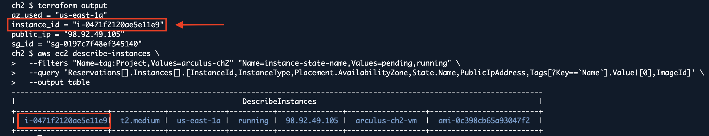
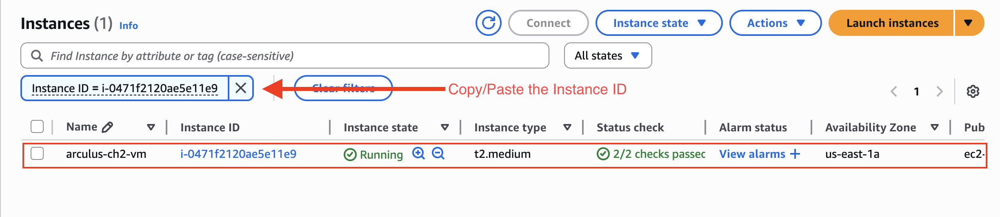

# Chapter 3 - Basic Commands

## 3.1 Overview 


## 3.2 Script Commands

**Before Copying/Pasting the main.tf script, follow the instructions below:**

* Make sure the variable name under "Project" is changed from "arculus-ch2" to "Your Unique Name". If not changed, the provisioning will fail.
* Change the "name_prefix" under the Security group section to "Your Unique Name". If not changed, the provisioning will fail due to SG name already existing.

```bash
cat > main.tf <<'HCL'
terraform {
  required_providers {
    aws = { source = "hashicorp/aws", version = "~> 5.0" }
  }
}

# ---- Variables (multi-line) ----
variable "region" {
  type    = string
  default = "us-east-1"
}

variable "project" {
  type    = string
  default = "arculus-ch2"  # <<<<<---------Change the VM name to your unique name, if not, provisioning will fail.
}

variable "az" {
  type    = string
  default = "us-east-1a"  
}

variable "instance_type" {
  type    = string
  default = "t2.medium"
}

# ---- Provider ----
provider "aws" {
  region = var.region
}

# ---- Networking ----
resource "aws_vpc" "vpc" {
  cidr_block           = "10.0.0.0/16"
  enable_dns_support   = true
  enable_dns_hostnames = true
  tags = { Name = "${var.project}-vpc" }
}

resource "aws_internet_gateway" "igw" {
  vpc_id = aws_vpc.vpc.id
  tags   = { Name = "${var.project}-igw" }
}

resource "aws_subnet" "public" {
  vpc_id                  = aws_vpc.vpc.id
  cidr_block              = "10.0.1.0/24"
  map_public_ip_on_launch = true
  availability_zone       = var.az
  tags = { Name = "${var.project}-subnet" }
}

resource "aws_route_table" "rt" {
  vpc_id = aws_vpc.vpc.id
  tags   = { Name = "${var.project}-rt" }
}

resource "aws_route" "default" {
  route_table_id         = aws_route_table.rt.id
  destination_cidr_block = "0.0.0.0/0"
  gateway_id             = aws_internet_gateway.igw.id
}

resource "aws_route_table_association" "assoc" {
  subnet_id      = aws_subnet.public.id
  route_table_id = aws_route_table.rt.id
}

# Security Group Section:
resource "aws_security_group" "egress_only" {
  name_prefix = "sample_terra-"    # <<<-------------change this to your unique security group name
  description = "No inbound; all outbound"
  vpc_id      = aws_vpc.vpc.id

  egress {
    from_port   = 0
    to_port     = 0
    protocol    = "-1"
    cidr_blocks = ["0.0.0.0/0"]
  }

  tags = { Name = "sample_terra" }
}

# ---- AMI: Ubuntu 22.04 LTS (Jammy), Canonical owner 099720109477 ----
data "aws_ami" "ubuntu_jammy" {
  most_recent = true
  owners      = ["099720109477"]

  filter {
    name   = "name"
    values = ["ubuntu/images/hvm-ssd/ubuntu-jammy-22.04-amd64-server-*"]
  }

  filter {
    name   = "virtualization-type"
    values = ["hvm"]
  }

  filter {
    name   = "architecture"
    values = ["x86_64"]
  }
}

# ---- EC2 (Ubuntu, no key, no IAM/SSM) ----
resource "aws_instance" "vm" {
  ami                         = data.aws_ami.ubuntu_jammy.id
  instance_type               = var.instance_type
  subnet_id                   = aws_subnet.public.id
  vpc_security_group_ids      = [aws_security_group.egress_only.id]
  associate_public_ip_address = true

  tags = {
    Name    = "${var.project}-vm"
    Project = var.project
    OS      = "Ubuntu-22.04"
  }
}

# ---- Outputs ----
output "instance_id" { value = aws_instance.vm.id }
output "public_ip"   { value = aws_instance.vm.public_ip }
output "sg_id"       { value = aws_security_group.egress_only.id }
output "az_used"     { value = var.az }
HCL
```

* Run terraform init to download providers and set up the working directory, terraform fmt to auto-format HCL, and terraform validate to catch syntax/config errors.

* Then terraform apply creates the VPC, subnet, route, unique sample_terra SG, and Ubuntu t2.medium EC2 in the specified region/AZ.

## 3.3 Running Main.tf Scripts

```bash
terraform init -reconfigure
terraform fmt
terraform validate
terraform apply -auto-approve -var="region=${AWS_REGION}" -var="az=us-east-1a"
```
<p align="center"> </p>

* Terraform finished initialization successfully—your working directory is set up and the AWS provider/plugins were found.

<p align="center"> </p>

## 3.4 Verify you results:
```bash
terraform output
aws ec2 describe-instances \
  --filters "Name=tag:Project,Values=arculus-ch2" "Name=instance-state-name,Values=pending,running" \
  --query 'Reservations[].Instances[].[InstanceId,InstanceType,Placement.AvailabilityZone,State.Name,PublicIpAddress,Tags[?Key==`Name`].Value|[0],ImageId]' \
  --output table
```
<p align="center"> </p>

* Copy the **Instance ID value**. For example, in the picture above, the instance ID value is "i-0471f2120ae5e11e9".

* In the top search bar, type EC2 and select **EC2** from the services list.

<p align="center"> </p>

<p align="center"> </p>

<p align="center"> </p>

## 3.5 Clean Up
```bash
terraform destroy -auto-approve -var="region=${AWS_REGION}" -var="az=$(terraform output -raw az_used 2>/dev/null || echo us-east-1a)"
```

## 3.6 As a Result

This chapter demonstrated provisioning of an EC2 stack with Terraform from AWS CloudShell—installing Terraform in /tmp, directing Terraform state and plugin cache to /tmp, and relying on CloudShell’s role-based credentials. A minimal, production-style configuration was authored: VPC, public subnet, internet route, a unique egress-only security group, and an Ubuntu 22.04 t2.medium instance. Deployment was initialized, applied, and verified via Terraform outputs and the EC2 console.
