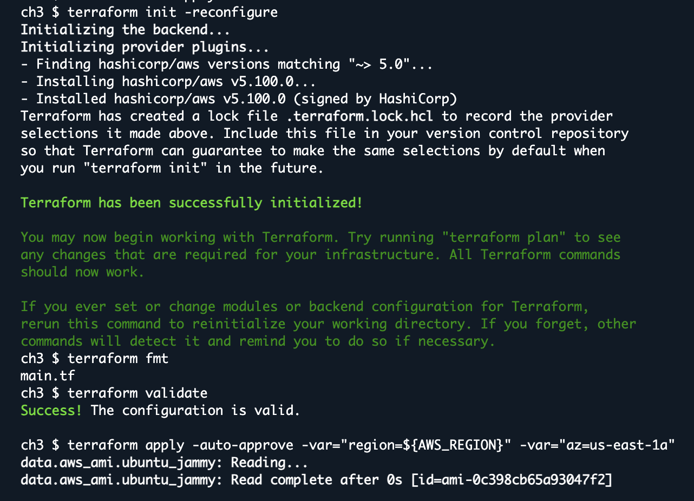
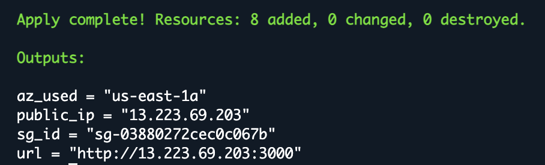
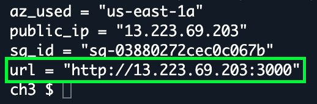
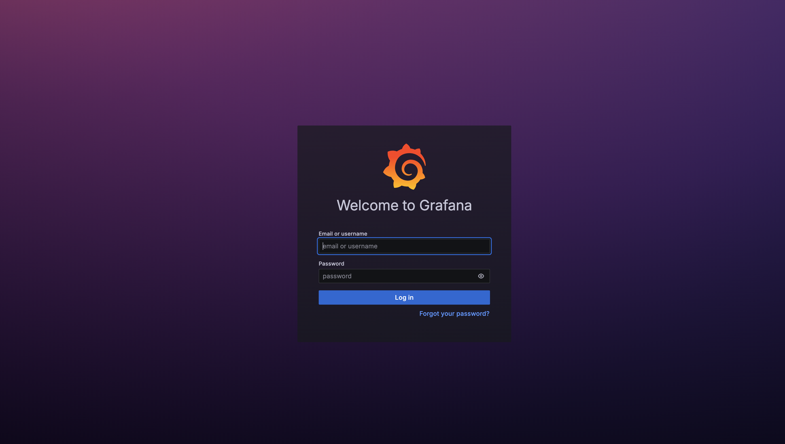
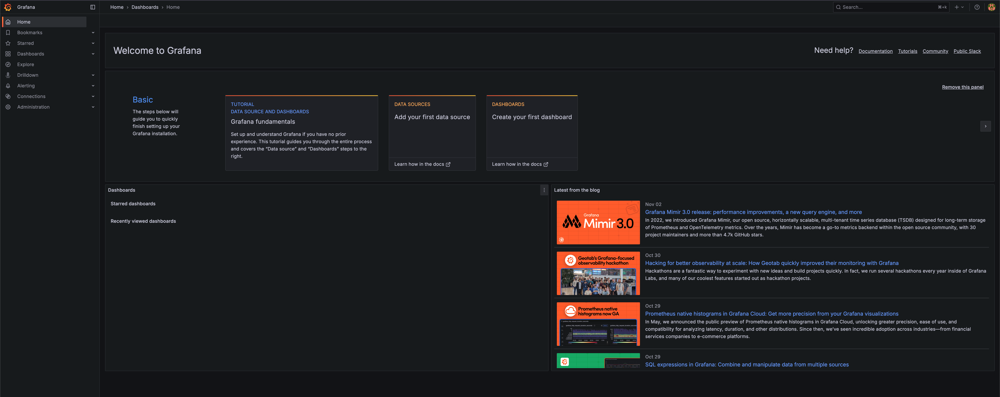

# Chapter 4 - Guardrails (Expose, Verify, Lock Down)

## 4.1 Overview

In cloud security, guardrails are predefined, automated controls (e.g., security groups, IAM boundaries, routing rules) that prevent unsafe configurations and enforce desired ones. Guardrails do not block work; they shape it safely by default and make deviations explicit and reviewable.

This chapter demonstrates least-privilege network access for a simple service. A new Ubuntu t2.medium instance is launched with Grafana running on TCP/3000 via user_data. An inbound rule is first opened to the world for quick verification, then tightened to a single /32 address. A URL is emitted for testing, and an optional no-ingress approach (SSM port-forwarding) is outlined for later use.

## 4.2 CloudShell Setup (same pattern as Chapter 2)

**What this does**: Installs Terraform to /tmp, uses CloudShell role creds, stores TF state/plugins in /tmp, and prepares the ch3 working directory.

```bash
export AWS_REGION=${AWS_REGION:-us-east-1}

unset AWS_PROFILE AWS_SDK_LOAD_CONFIG AWS_ACCESS_KEY_ID AWS_SECRET_ACCESS_KEY AWS_SESSION_TOKEN

TF_VERSION="1.9.5"
ARCH=$(uname -m); case "$ARCH" in x86_64) TF_ARCH="amd64" ;; aarch64) TF_ARCH="arm64" ;; *) echo "Unsupported arch: $ARCH"; exit 1 ;; esac
mkdir -p /tmp/bin /tmp/arculus/ch3
curl -fsSLo /tmp/terraform.zip "https://releases.hashicorp.com/terraform/${TF_VERSION}/terraform_${TF_VERSION}_linux_${TF_ARCH}.zip"
unzip -o /tmp/terraform.zip -d /tmp/bin >/dev/null
export PATH="/tmp/bin:$PATH"
terraform -version

export TF_DATA_DIR=/tmp/.tfdata
export TF_PLUGIN_CACHE_DIR=/tmp/.tfplugins
mkdir -p "$TF_PLUGIN_CACHE_DIR"

# Work directory
cd /tmp/arculus/ch3
```

## 4.3 Write Main.tf 

This creates a tiny VPC, public subnet, IGW + route, a unique SG that allows only app_port from allow_cidr, then boots Ubuntu and installs Grafana via user_data. An HTTP URL is emitted.

```bash
cat > main.tf <<'HCL'
############################################################
# Chapter 4 — Static Web (AMI baked with nginx + your page)
# Region: us-east-1 | AMI: ami-0da4418d8d1b56a0c
############################################################

terraform {
  required_version = ">= 1.6.0"
  required_providers {
    aws = {
      source  = "hashicorp/aws"
      version = "~> 5.0"
    }
  }
}

#########################
# Variables
#########################
variable "region" {
  type    = string
  default = "us-east-1"
}

variable "project" {
  type    = string
  default = "terraform-ch4-web"
}

variable "availability_zone" {
  type    = string
  default = "us-east-1a"
}

variable "instance_type" {
  type    = string
  default = "t3.micro"
}

# Start open to verify; immediately re-apply with your /32 afterwards.
variable "allow_cidr" {
  type    = string
  default = "0.0.0.0/0"
}

# Optional SSH (off by default). Prefer SSM for class.
variable "enable_ssh" {
  type    = bool
  default = false
}

variable "ssh_cidr" {
  type    = string
  default = "YOUR.PUBLIC.IP/32"
}

provider "aws" {
  region = var.region
}

#########################
# Locals
#########################
locals {
  web_ami_id = "ami-0da4418d8d1b56a0c"

  # Heredoc marker must be UNQUOTED, end marker on its own line.
  user_data = <<-BASH
    #!/bin/bash
    set -euo pipefail
    if command -v systemctl >/dev/null 2>&1; then
      systemctl enable nginx || true
      systemctl restart nginx || true
    fi
  BASH
}

#########################
# Networking (minimal public VPC)
#########################
resource "aws_vpc" "this" {
  cidr_block           = "10.44.0.0/16"
  enable_dns_support   = true
  enable_dns_hostnames = true
  tags = {
    Name = "${var.project}-vpc"
  }
}

resource "aws_internet_gateway" "igw" {
  vpc_id = aws_vpc.this.id
  tags = {
    Name = "${var.project}-igw"
  }
}

resource "aws_subnet" "public_a" {
  vpc_id                  = aws_vpc.this.id
  cidr_block              = "10.44.1.0/24"
  availability_zone       = var.availability_zone
  map_public_ip_on_launch = true
  tags = {
    Name = "${var.project}-public-a"
  }
}

resource "aws_route_table" "public" {
  vpc_id = aws_vpc.this.id
  tags = {
    Name = "${var.project}-rt"
  }
}

resource "aws_route" "igw_default" {
  route_table_id         = aws_route_table.public.id
  destination_cidr_block = "0.0.0.0/0"
  gateway_id             = aws_internet_gateway.igw.id
}

resource "aws_route_table_association" "a" {
  subnet_id      = aws_subnet.public_a.id
  route_table_id = aws_route_table.public.id
}

#########################
# Security Group — HTTP :80 from allow_cidr (+ optional SSH)
#########################
resource "aws_security_group" "web" {
  name_prefix = "${var.project}-sg-"
  description = "HTTP 80 from allow_cidr; optional SSH; all egress"
  vpc_id      = aws_vpc.this.id

  ingress {
    description = "HTTP"
    from_port   = 80
    to_port     = 80
    protocol    = "tcp"
    cidr_blocks = [var.allow_cidr]
  }

  dynamic "ingress" {
    for_each = var.enable_ssh ? [1] : []
    content {
      description = "SSH (optional)"
      from_port   = 22
      to_port     = 22
      protocol    = "tcp"
      cidr_blocks = [var.ssh_cidr]
    }
  }

  egress {
    from_port   = 0
    to_port     = 0
    protocol    = "-1"
    cidr_blocks = ["0.0.0.0/0"]
  }

  tags = {
    Name = "${var.project}-web-sg"
  }
}

#########################
# EC2 — launch from your baked AMI
#########################
resource "aws_instance" "web" {
  ami                         = local.web_ami_id
  instance_type               = var.instance_type
  subnet_id                   = aws_subnet.public_a.id
  vpc_security_group_ids      = [aws_security_group.web.id]
  associate_public_ip_address = true
  user_data                   = local.user_data

  tags = {
    Name    = "${var.project}-vm"
    Project = var.project
    Role    = "chapter4-web"
  }
}

#########################
# Outputs
#########################
output "chapter4_url" {
  value = "http://${aws_instance.web.public_ip}"
}

output "public_ip" {
  value = aws_instance.web.public_ip
}

output "security_group" {
  value = aws_security_group.web.id
}

output "reminder" {
  value = "AFTER VERIFY: re-apply with -var=allow_cidr=YOUR.IP/32 (or close 80 and use SSM port-forwarding)."
}


HCL

```

## 4.4 Init & Apply
```bash
terraform init
terraform fmt
terraform validate
terraform apply -auto-approve -var="allow_cidr=0.0.0.0/0"
# verify, then lock down:
terraform apply -auto-approve -var="allow_cidr=YOUR.PUBLIC.IP/32"
```
 * If the AZ rejects t2.medium, re-run with a supported one:

```bash
terraform apply -auto-approve -var="region=${AWS_REGION}" -var="az=us-east-1b"
```
<p align="center"> </p>
<p align="center"> </p>

## 4.5 Verifying the Service
```bash
terraform output # Open the printed `url` in the browser, e.g., http://PUBLIC_IP:3000
```
<p align="center"> </p>

* Once you've entered the link based on the output, you will arrive in the Grafana UI.

<p align="center"> </p>

* Here you can enter the default **"Username: Admin"** and **"Password: Admin"**. Then, you can reset your password and enter the portal.

<p align="center"> </p>

## 4.6 Cleanup
```bash
terraform destroy -auto-approve \
  -var="region=${AWS_REGION}" \
  -var="az=$(terraform output -raw az_used 2>/dev/null || echo us-east-1a)"
```
<p align="center"> </p>

## 4.7 As a Result:

This chapter demonstrated network guardrails as policy-as-code: a minimal Grafana service was deployed, verified via an open ingress rule, and then constrained to a single /32, reducing exposure while preserving functionality. Controls were codified in Terraform (security group, routing, outputs), showing a repeatable pattern to expose, verify, and tighten access. The chapter also introduced a no-ingress direction (SSM port-forwarding) for stricter Zero-Trust edge deployments.
